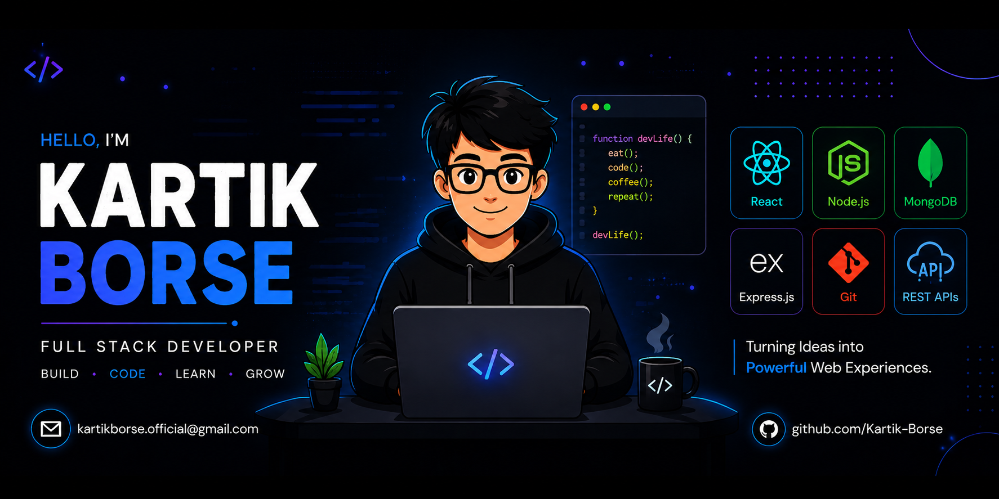

<!-- ========================================================= -->
<!--                       GITHUB PROFILE                       -->
<!-- ========================================================= -->

  

<!-- <h1 align="center">
Hi 👋, I'm Kartik Borse
</h1> -->

<h3 align="center">
Full Stack Developer • MERN Stack • Open Source Enthusiast
</h3>

Building modern, scalable, and user-centric web applications with the MERN Stack while continuously learning, contributing to open source, and solving real-world problems through clean and efficient code.

---

## 🛠️ Tech Stack & Tools

| **Languages** | **Frontend** | **Backend** | **Databases** | **Tools & Platforms** |
| :---: | :---: | :---: | :---: | :---: |
|       |     |   |      |      |

&nbsp;
&nbsp;
&nbsp;

---

## 🚀 Featured Projects

<table>
<tr>
<td width="50%">

### 💼 NexHire
**AI-Powered Hiring Platform**

AI-powered recruitment platform featuring ATS resume analysis, AI job recommendations, candidate ranking, recruiter dashboard, and JWT authentication.

**Tech Stack:** React • Node.js • Express • Supabase • PostgreSQL • Gemini AI

</td>

<td width="50%">

### 🎓 Scholar Mentor
**Alumni Network Platform**

A centralized platform connecting students, alumni, and mentors with authentication, messaging, and role-based access control.

**Tech Stack:** React • Node.js • Express • Supabase

</td>
</tr>

<tr>
<td colspan="2">

### 📚 PrepOS
**AI Placement Preparation Platform**

An AI-powered platform for DSA, aptitude, Core CS, coding practice, and interview preparation with personalized learning support.

**Tech Stack:** React • TypeScript • Node.js • PostgreSQL • Gemini AI

</td>
</tr>
</table>

## ⭐ Thanks for Visiting!

### Always open to meaningful collaborations, innovative ideas, and exciting opportunities.

Feel free to connect, collaborate, or explore my projects. 🚀

